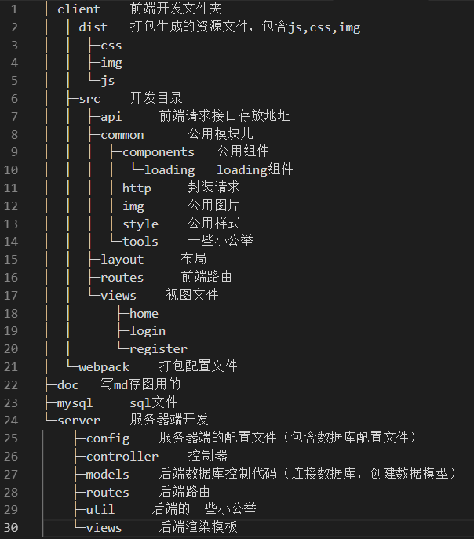

<div align="center">
	<a href="#">
		
	</a>
	<h2>二毛伪全栈框架初探^_^</h2>
	<p align="left">
		一个简单的登录注册全栈框架，不够完善，仅仅只是简单的数据的写入读取，但是客户端-服务器-数据库整个流程算是都过了一遍，在这里做个小笔记。日后有时间再慢慢完善，嘿嘿嘿......
	<p>
</div>

<h2 align="center">安装运行</h2>

+ [node安装](http://www.runoob.com/nodejs/nodejs-install-setup.html)
+ [mysql安装](http://www.runoob.com/mysql/mysql-install.html)

mysql安装完成之后，默认的root用户密码为空，使用下面的命令创建root用户的密码
```
mysqladmin -u root password "new_password"
```
然后连接mysql数据库
```
mysql -u root -p
```
输入密码的时候是不显示的...嘤QAQ

当然也可以使用工具啦嘻嘻，就很快~我用的[Navicat Premium 12](https://blog.csdn.net/zuihongyan518/article/details/80951911)。连接数据库之后创建数据库，名字你自己随便填，然后将mysql中的sql文件导入数据库，生成相对应的表结构，最后在./server/config/下新建数据库配置文件db.json，在该文件中配置mysql的数据库名称和用户名密码即可，内容示例如下：
```
{
    "mysql": {
        "host": "127.0.0.1",
        "port": 4578,
        "username": "root",
        "password": "123456",
        "dbName": "ermao"
    }
}
```
如果是自己的服务器ip的话，建议在gitignore文件中加入这个配置文件...要不是同事提醒我，差点就把密码泄露了呢，嘤嘤嘤

环境配置好之后，在根目录下执行
```
npm i
npm run dev
```
然后浏览器打开链接[http://localhost:3030](http://localhost:3030)，就可以看到页面啦~

也可以执行`npm run build`命令打包，然后浏览器打开[http://localhost:2333](http://localhost:2333),也是可以的~

默认webpack服务器端口号为3030，node服务器端的端口号为2333


<h2 align="center">框架搭建过程</h2>

技术栈：[react](https://reactjs.org/docs/getting-started.html)、[koa](https://chenshenhai.github.io/koa2-note/)、[webpack](https://webpack.docschina.org/concepts/)

挑一两个相关涉及package：[superagent](https://cnodejs.org/topic/5378720ed6e2d16149fa16bd)、[sequelize](https://demopark.github.io/sequelize-docs-Zh-CN/)

目录结构如下：



```
├─client    前端开发文件夹
│  ├─dist   打包生成的资源文件，包含js,css,img
│  │  ├─css
│  │  ├─img
│  │  └─js
│  ├─src    开发目录
│  │  ├─api     前端请求接口存放地址
│  │  ├─common      公用模块儿
│  │  │  ├─components   公用组件
│  │  │  │  └─loading   loading组件
│  │  │  ├─http     封装请求
│  │  │  ├─img      公用图片
│  │  │  ├─style    公用样式
│  │  │  └─tools    一些小公举
│  │  ├─layout     布局
│  │  ├─routes     前端路由
│  │  └─views    视图文件
│  │      ├─home
│  │      ├─login
│  │      └─register
│  └─webpack    打包配置文件
├─doc   写md存图用的
├─mysql     sql文件
└─server    服务器端开发
    ├─config    服务器端的配置文件（包含数据库配置文件）
    ├─controller    控制器
    ├─models    后端数据库控制代码（连接数据库，创建数据模型）
    ├─routes    后端路由
    ├─util     后端的一些小公举 
    └─views     后端渲染模板
```
