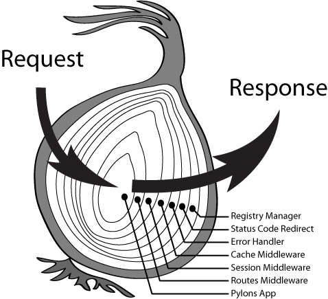
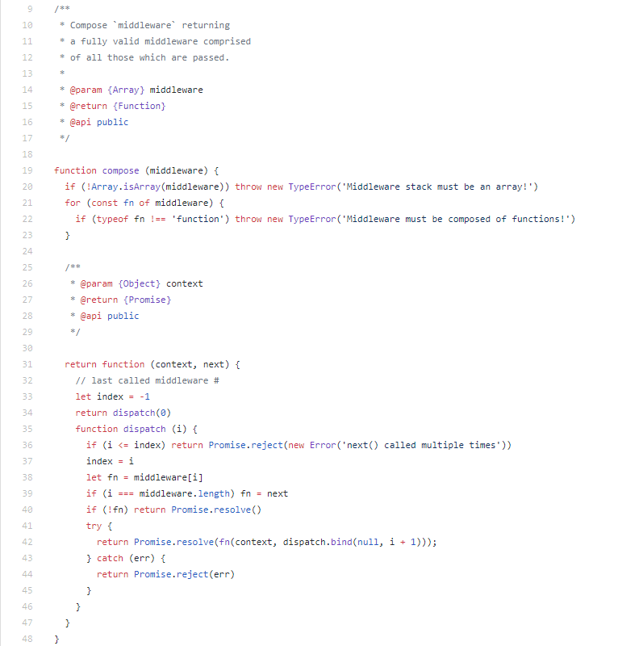

<div align="center">
	<a href="#">
		
	</a>
	<h2>二毛伪全栈框架初探^_^</h2>
	<p align="left">
		一个简单的登录注册全栈框架，不够完善，仅仅只是简单的数据的写入读取，但是客户端-服务器-数据库整个流程算是都过了一遍，在这里做个小笔记。日后有时间再慢慢完善，嘿嘿嘿......
	<p>
</div>

<h2 align="center">安装运行</h2>

+ [node安装](http://www.runoob.com/nodejs/nodejs-install-setup.html)
+ [mysql安装](http://www.runoob.com/mysql/mysql-install.html)

mysql安装完成之后，默认的root用户密码为空，使用下面的命令创建root用户的密码
```
mysqladmin -u root password "new_password"
```
然后连接mysql数据库
```
mysql -u root -p
```
输入密码的时候是不显示的...嘤QAQ

当然也可以使用工具啦嘻嘻，就很快~我用的[Navicat Premium 12](https://blog.csdn.net/zuihongyan518/article/details/80951911)。连接数据库之后创建数据库，名字你自己随便填，然后将mysql中的sql文件导入数据库，生成相对应的表结构，最后在./server/config/下新建数据库配置文件db.json，在该文件中配置mysql的数据库名称和用户名密码即可，内容示例如下：
```
{
    "mysql": {
        "host": "127.0.0.1",
        "port": 4578,
        "username": "root",
        "password": "123456",
        "dbName": "ermao"
    }
}
```
如果是自己的服务器ip的话，建议在gitignore文件中加入这个配置文件...要不是同事提醒我，差点就把密码泄露了呢，嘤嘤嘤

环境配置好之后，在根目录下执行
```
npm i
npm run dev
```
然后浏览器打开链接[http://localhost:3030](http://localhost:3030)，就可以看到页面啦~

也可以执行`npm run build`命令打包，然后浏览器打开[http://localhost:2333](http://localhost:2333),也是可以的~

默认webpack服务器端口号为3030，node服务器端的端口号为2333


<h2 align="center">框架搭建过程</h2>

技术栈：[react](https://reactjs.org/docs/getting-started.html)、[koa](https://chenshenhai.github.io/koa2-note/)、[webpack](https://webpack.docschina.org/concepts/)、[babel](https://www.babeljs.cn/docs/usage/babelrc/)

挑一两个相关涉及package：[superagent](https://cnodejs.org/topic/5378720ed6e2d16149fa16bd)、[sequelize](https://demopark.github.io/sequelize-docs-Zh-CN/)

开发还是区分的前后端，client里面是react、webpack，server里面是koa。目录结构如下：


<h3 align="center">关于webpack和babel</h3>

webpack和babel都是用的目前最新版，这个时候webpack版本是`4.16.4`......想要逼逼叨捋一下的欲望蠢蠢欲动，唔，那就简要逼逼叨一下webpack吧~

我觉得官网说的很棒（手动滑稽）
```
本质上，webpack 是一个现代 JavaScript 应用程序的静态模块打包器(static module bundler)。在 webpack 处理应用程序时，它会在内部创建一个依赖图(dependency graph)，用于映射到项目需要的每个模块，然后将所有这些依赖生成到一个或多个bundle。
```
我的理解就是按照依赖打包资源，完成资源的合并、删除、babel转换编译等等操作。

babel呢，是一个js编译器，提供一个es6+的环境，能够解析es6+，然后转换生成可以在浏览器中运行的代码。它的所有转译都是使用本地配置文件`.babelrc`或者`package.json`，具体配置可以参考[Options](https://www.babeljs.cn/docs/core-packages/#options)和[Plugins](https://www.babeljs.cn/docs/plugins/)

### 配置webpack

一般会准备两份配置文件，一份是开发时用的，一份是打包的时候用的。区别就是开发时需要热替换，不用进行压缩资源，转发请求至node服务器，支持[source map](https://blog.fundebug.com/2017/03/13/sourcemap-tutorial/)等等，总之开发时需要的配置是方便开发调试。而打包部署时所需要的配置主要针对的是压缩打包资源的大小。

#### [入口（Input）](https://webpack.docschina.org/configuration/entry-context/)
```
entry: {
	bundle: "./client/src",
	vendor: [
		"react",
		"react-dom",
		"react-router",
		"react-router-dom",
		"superagent",
		"@ckeditor/ckeditor5-build-classic"
	]
}
```
入口配置分离了应用程序（bundle）和第三方库（vendor）入口。这样的分离配置而不是简写的`entry: "./index.js"`主要是允许使用`CommonsChunkPlugin`从bundle中提取vendor引用到vendor的bundle中，并且把引用vendor的部分替换成`__webpack_require__()`调用，就像这个样子：


一般第三方库不会频繁产生变动，所以需要可以在浏览器缓存这种稳定的资源，那么分离入口就达到了把稳定资源单独提取出来的作用，提取出来之后就要缓存在客户端，而且当某部分模块产生变更时，不会使得所有模块的缓存失效。webpack4移除了`CommonsChunkPlugin`，取而代之的是两个新的配置项[optimization.splitChunks和optimization.runtimeChunk](https://segmentfault.com/a/1190000013476837)，用法如下：
```
optimization: {
	// 将模块分离到单独的文件中
	splitChunks: {
		// 将第三方库缓存在客户端
		cacheGroups: {
			vendor: {
				chunks: "initial",    // "infinity" 等价于入口数量，即所有入口都引用的模块才会提取出来
				name: "vendor",
				enforce: true
			},
		}
	},
	// 优化持久化缓存。将模块信息单独打包出来，使得变更某个模块时缓存不会失效
	runtimeChunk: true
}
```
optimization.runtimeChunk 的理解有点不太好懂，[感觉这个解释得比较直白一点](https://segmentfault.com/q/1010000014954264)


#### [输出（output）](https://webpack.docschina.org/configuration/output/)
```
output: {
	// 输出目录的绝对路径 distDir=path.resolve(__dirname, "../dist")
	path: distDir,
	filename: "js/[name].[chunkhash:8].js",
	chunkFilename: "js/[name].chunk.[chunkhash:8].js",
	publicPath: "/"		// 使用CDN
}
```
#### [loader](https://webpack.docschina.org/concepts/loaders/)
loader就相当于gulp中的task，对模块的源码进行转换，比如：
```
{
	test: /\.jsx?$/,
	include: [
		path.resolve(__dirname, "../src")
	],
	use: [
		"babel-loader"
	]
}
```
意思就是对每个`.jsx`使用`babel-loader`
#### [plugins](https://webpack.docschina.org/concepts/plugins/)
pulgins就是插件啊，一般loader没法干的事，都会有这么一个插件来补充，总的来讲，锦上添花，事半功倍。


#### [webpack-serve](https://webpack.docschina.org/configuration/dev-server/)
这个服务器等于一个微型的express或者koa框架, 使用它可以使用nodejs完成一个简单的本地服务器, 并支持热替换功能, 主要是检测webpack打包过程和让程序支持热替换
```
serve: {
	content: [path.resolve(__dirname, "../dist")],
	hot: true,
	port: "3030",
	add: (app) => {            
		app.use(convert(proxy("/api", { target: "http://localhost:2333" })));
		app.use(convert(history({
			disableDotRule: true,
			verbose: true,
			htmlAcceptHeaders: ["text/html", "application/xhtml+xml"]
		})));
	},
}
```
唔，具体的突然懒得说了，ant写了篇文章简单介绍了一下，可以看一下[webpack-serve 的使用](https://segmentfault.com/a/1190000015559392)


webpack的水是真的深，在知识的海洋里浮浮沉沉，只是感觉，好像学不完了嘤嘤嘤T_T

<h3 align="center">关于服务器端</h3>

服务器端的主要工作就是：请求代理（相当于一个servies）、路由、模板渲染。开发框架呢，我选了koa，原因就是，以前用过express，这次换个新的试试看~当然，用了之后还是有点小想法的：

+ koa比express更轻巧。koa是模块化的，不像express是一个很完善的框架，koa就可以个性化定制，想用啥就用啥，唔，因为这是个简单的小项目，想着用个相比之下更轻巧一点的koa比较合适
+ koa用新的[async/await](https://segmentfault.com/a/1190000007535316)关键字代替express的回调。koa基于es6特性开发，感觉用起来很舒服，看起来像同步代码，读代码更容易

其他的我还没什么体验，这次项目小，也就这个样子了。具体对比可以参考[koa vs express](https://raygun.com/blog/koa-vs-express-2018/)

### 关于koa

说到这儿，脑子里立马想到的是next()...主要是之前看源码看得脑阔痛，反应就比较强烈一点= =唔，顺便捋一下，记一笔~首先，看两个效果：


这样看就大概知道next是啥意思了，它的作用就相当于是把执行控制权转交给下一个中间件，当执行到最后一层中间件触底之后，就会返回执行权，逆行上去，如果当前中间件没有终结请求而且没有调用next，那么请求就会被挂起，后面的中间件就得不到执行的机会。这种形式叫洋葱圈模型，如下图：



这段代码简要理解一下就是这样的：
```
one = (ctx, next) => {
    console.log("+++ one");
    next(); -----------------------> two = (ctx, next) => {
                                        console.log("+++ two");
                                        next(); -----------------------> three = (ctx, next) => {
                                                                            console.log("+++ three"); ---->|
                                                                            console.log("--- three"); <----|
                                                                        };
                                        console.log("--- two");
                                    };
    console.log("--- one");
};
```
[看一下源码理解](https://juejin.im/entry/59e747f0f265da431c6f668e)得更深一点，koa源码主要有四个文件：
```
├─benchmarks
├─docs
│  └─api
│          
├─lib
│      application.js   // koa的核心了
│      context.js   // 唔没啥主要功能，里面是一些小工具型的函数
│      request.js   // 主要是用于处理请求头结构体的，获取和修改，一堆set和get
│      response.js  // 处理响应头的，也是一堆set和get
│      
└─test
    │  
    ├─application
    │      
    ├─context
    │      
    ├─helpers
    │      
    ├─request
    │      
    └─response 
```

着重看一下`application.js`，阅读起来难度不大，代码245行，可以说很少了，挑挑拣拣说一下:

koa用法大概像下面这样：


首先new一个koa实例，然后执行use方法和listen方法，简简单单，接下来就看一下use是干什么用的


use的主要作用是将中间件`push`到`this.middleware`中，第一个`if`是检查是不是函数，第二个是检查并兼容[Generator函数](http://es6.ruanyifeng.com/#docs/generator)，一番检查之后就push进一个数组了。

然后是走到了调用listen函数的地方：


koa使用了node的原生http包来创建http服务，listen函数主要是开启了`http`服务器，开始处理http请求，callback主要是用来生成`createServer`的回调，看代码是中间件`this.middleware`数组被封装成了一个名为 fn 的对象，然后通过将context传入这个对象来返回一个promise。

这里面的问题就在于这个`compose`函数，它是一个封装好了的模块[`koa-composer`](https://github.com/koajs/compose)，大概看一下里面的源码：



一番安全检查之后，就是一个递归函数，捋半天可以理解出来思路，大概意思就是把第 i+1 个中间件作为next函数传给第 i 个中间件，所以就需要主动去调用next，不然后续的中间件就执行。这个地方还是要想半天的= =
```
let index = -1
return dispatch(0)
function dispatch (i) {
	if (i <= index) return Promise.reject(new Error('next() called multiple times'))
	index = i
	let fn = middleware[i]
	if (i === middleware.length) fn = next
	if (!fn) return Promise.resolve()
	try {
		return Promise.resolve(fn(context, dispatch.bind(null, i + 1)));
	} catch (err) {
		return Promise.reject(err)
	}
}
```
koa就大概说到这里吧，说的有点长= =但是koa的源码真的很少，还有注释，嗨森，可阅读性比较好~

### 关于数据库

我也是无意间发现[`sequelize`](https://demopark.github.io/sequelize-docs-Zh-CN/)的，Sequelize 是一个基于 promise 的 Node.js ORM, 目前支持 Postgres, MySQL, SQLite 和 Microsoft SQL Server，它具有强大的事务支持，关联关系，读取和复制等功能。就是把数据库的sql语句封装好，针对不同的功能对外提供相应的api。

大概用法就是这样：

首先是建立数据库连接，设置连接池


然后是使用[数据模型](https://demopark.github.io/sequelize-docs-Zh-CN/models-definition.html)，映射数据库中的表


最后就可以肆意使用啦


亲测真的很好用，也很好理解